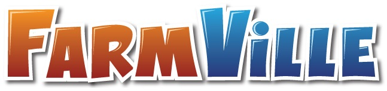

# FarmVille
<!--  -->

> FarmVille 1 officially closed December 31th, 2020

The FarmVille 1 preservation project by the Farm Village team. This project is dedicated to preserving this Flash game so that it's not lost to time.

[](../../releases/latest)
[](https://discord.gg/Bm2EkN5vhz)

---

## Releases

| Version | Release date | Source | Download |
| --- | --- | --- | --- |
| **alpha 0.01a** | September 17, 2024 | :label: [tag](../../releases/tag/0.01a) | :package: [Bundle](../../releases/download/0.01a/farmvillage_0.01a.zip) (55 MB) |

| :information_source: | The minimal _Bundle_ version does not include any assets or WARC files due to its size of approximately 17 GB. Instead, WARC files will be automatically downloaded and extracted the first time the server is launched. Please be patient during this initial setup process. |
| --- | :--- |

## Reporting Bugs and Contacting

:speech_balloon: Check our [Discord group](https://discord.gg/Bm2EkN5vhz)

:paw_prints: The project [Contributors](../../contributors)

## How to Install on Windows

- Download a flash-compatible browser. :flashlight: Options can be found [here](FLASH.md).
- Download the latest version from the [Releases](#releases) section.
- Extract the downloaded zip file to a suitable location.

## How to Play

- Run the *farmvillage* executable.
- Open your flash browser and navigate to `http://127.0.0.1:5500/`.

:information_source: To play on GNU/Linux check [this page](LINUX.md).

## Tools

:penguin: [FarmVille on GNU/Linux](LINUX.md)

:flashlight: [Flash Continuation](FLASH.md) documentation

## External Links

:beginner: [FarmVille 1 Wiki (FANDOM)](https://farmville.fandom.com/wiki/FarmVille_Wiki)

## On archives and accessibility to digital heritage

- [Exemption to PCCPSACT](https://www.federalregister.gov/documents/2018/10/26/2018-23241/exemption-to-prohibition-on-circumvention-of-copyright-protection-systems-for-access-control), exemptions to the provision of the Digital Millennium Copyright Act (“DMCA”). 
- [EFGAMP](https://efgamp.eu/), the European Federation of Video Game Archives, Museums and Preservation projects.
- [UNESCO PERSIST Programme](https://unescopersist.org/), helps ensure that digital information can continue to be accessed in the future.
- [The Internet Archive](https://archive.org/), a digital library of Internet sites and other cultural artifacts in digital form.
- [BlueMaxima's Flashpoint](https://bluemaxima.org/flashpoint/), the webgame preservation project.
- [Adobe Flash Player Archive](https://archive.org/download/flashplayerarchive/), the Adobe Inc. archive.org Flash Player Archive.

---

## License [](http://www.gnu.org/licenses/gpl-3.0)

```
FarmVille 1 preservation project.
Copyright (C) 2024  The Farm Village team
See the GNU General Public License <https://www.gnu.org/licenses/>.
```
